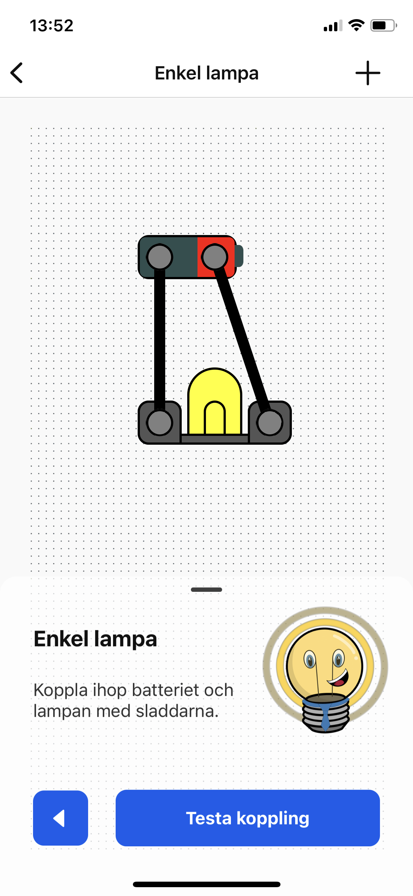

<a name="readme-top"></a>

<!-- PROJECT LOGO -->
<br />
<div align="center">
  <a href="https://github.com/eliasakesson/volted">
    
  </a>

  <h3 align="center">Träsmak UF</h3>

  <p align="center">
    Award winning mobile application built with React Native
    <br />
    <br />
    <a href="https://github.com/eliasakesson/volted"><strong>Explore the docs »</strong></a>
  </p>
</div>

<!-- ABOUT THE PROJECT -->
## About The Project

<div style="display:flex">
  
  
  
</div>

### Volted

Volted is a mobile app built with React Native and Firebase, that uses the Expo framework.

With this app, students can experiment with building different circuits and learn about the basic principles of electricity and electronics. The user-friendly interface allows students to easily drag and drop components to create working circuits.

Features:
* A variety of circuit components to choose from
* Step-by-step tutorials to guide students through building different circuits
* Quizzes to test student's understanding of the concepts covered

The app is designed for the Blixtlåset competition, which encourages students to explore and learn about technology and engineering. Our goal is to make learning about electronics fun and engaging for kids.

<p align="right">(<a href="#readme-top">back to top</a>)</p>

### Built With

Here are the main frameworks and libraries i've used for this project:

* ![React Native][React.js]
* ![Expo][Expo]
* ![Javascript][Javascript]

<p align="right">(<a href="#readme-top">back to top</a>)</p>

<!-- GETTING STARTED -->
## Getting Started

Here is how you can run the application yourself

1. Clone the repo
   ```sh
   git clone https://github.com/eliasakesson/volted.git
   ```
2. Install NPM packages
   ```sh
   npm install
   ```
3. Run the app in development mode:
   ```sh
   npx expo start
   ```

   or in production mode:
   ```sh
   npx expo start --no-dev --minify
   ```
4. Download the "Expo Go" app and scan the QR code from the terminal

<p align="right">(<a href="#readme-top">back to top</a>)</p>


<!-- LICENSE -->
## License

Distributed under the Apache-2.0 License. See `LICENSE.txt` for more information.

<p align="right">(<a href="#readme-top">back to top</a>)</p>


<!-- CONTACT -->
## Contact

<a href="https://www.linkedin.com/in/eliasakesson/" target="blank"></a>
.
<a href="https://github.com/eliasakesson" target="blank"></a>

<p align="right">(<a href="#readme-top">back to top</a>)</p>


<!-- ACKNOWLEDGMENTS -->
## Acknowledgments

Here are a few of the libraries and tools i used for this project:

* [Img Shields](https://shields.io)
* [Font Awesome](https://fontawesome.com)
* [React Icons](https://react-icons.github.io/react-icons/search)

<p align="right">(<a href="#readme-top">back to top</a>)</p>


<!-- MARKDOWN LINKS & IMAGES -->
[logo]: public/images/logo.png
[product-screenshot]: public/images/home-page.png
[React.js]: https://img.shields.io/badge/react_native-%2320232a.svg?style=for-the-badge&logo=react&logoColor=%2361DAFB
[Expo]: https://img.shields.io/badge/expo-1C1E24?style=for-the-badge&logo=expo&logoColor=#D04A37
[Javascript]: https://img.shields.io/badge/javascript-%23323330.svg?style=for-the-badge&logo=javascript&logoColor=%23F7DF1E
